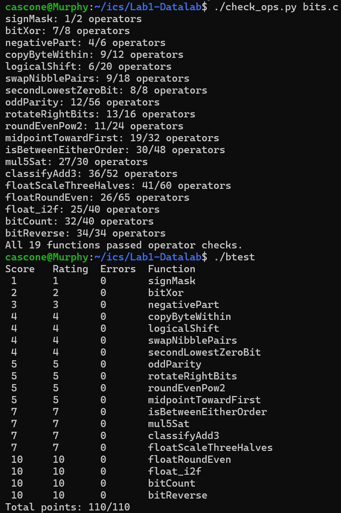

# 计算机系统基础 Lab1 DataLab 实验报告

姓名：王墨非　　学号：24300750009

## 测试结果

- 规则检查：`./check_ops.py bits.c` 输出 `All 19 functions passed operator checks.`
- 正确性测试：`./btest` 输出 `Total points: 110/110`，19 题全部零错误。

## 各题实现思路

### P1 signMask（1 分，1/2 ops）
返回最高位掩码 `0x80000000`：`1 << 31` 把唯一的 1 送到最高位。

### P2 bitXor（2 分，7/8 ops）
只允许 `~` 和 `&`，用德摩根律消掉 `|`：`x ^ y = (x | y) & ~(x & y)`，其中 `x | y = ~(~x & ~y)`。

### P3 negativePart（3 分，4/6 ops）
`x >> 31` 是天然的符号掩码（负数全 1、非负全 0）；`-x = ~x + 1`。两者相与，非负时被掩码清零，负数时得到 `-x`。

### P4 copyByteWithin（4 分，9/12 ops）
“挖洞 + 回填”：`(x >> (src<<3)) & 0xFF` 取出源字节（`& 0xFF` 剪掉算术右移带来的符号扩展）；用 `~(0xFF << (dst<<3))` 清空目标字节，再把源字节移回原位按位或。全程不计算 `src - dst`，避开负移位。

### P5 logicalShift（4 分，6/20 ops）
先做算术右移，再用掩码抹掉补进来的高位 1：`signBit = 1 << 31`，`smear = signBit >> n`（最高 n+1 位为 1），`keepLow = ~(smear << 1)`（高 n 位为 0），返回 `(x >> n) & keepLow`。

### P6 swapNibblePairs（4 分，9/18 ops）
用“翻倍法”拼出掩码 `0x0F0F0F0F`（`0x0F | (0x0F << 8)` 再 `| (m << 16)`）；`(x & m) << 4` 把低半字节上移，`(x >> 4) & m` 把高半字节下移（掩码挡住从相邻字节窜过来的位），按位或。

### P7 secondLowestZeroBit（4 分，8/8 ops）
x 的 0 位就是 `~x` 的 1 位，问题转化为找 `~x` 第二低的 1 位。两次 lowbit 技巧 `y & (~y + 1)`：第一次取最低 1 位（即 x 的最低 0 位），`y ^ low` 抠掉后再取一次就是第二低 0 位；0 位不足两个时自然返回 0，无需分支。

### P8 oddParity（5 分，12/56 ops）
异或是不进位加法，5 次折半异或（`x ^= x>>16`、`>>8`、`>>4`、`>>2`、`>>1`）后 bit0 就是全部 32 位的异或；返回 `~x & 1`（1 的个数为偶数时返回 1）。

### P9 rotateRightBits（5 分，13/16 ops）
`k = n & 31` 规约移位量；掉出去的低位经 `x << ((32 + ~k + 1) & 31)` 绕回高位（这样 k=0 时移 0 位而非 32 位）；主位移用 P5 的掩码转成逻辑右移；两段按位或。

### P10 roundEvenPow2（5 分，11/24 ops）
就近偶数舍入的“加偏置后截断”法：`q = x >> n` 为商，`half = 2^(n-1)`，偏置 `bias = half - 1 + (q & 1)`——余数大于 half 时进位，恰为 half 时按 q 的奇偶取偶；返回 `((x + bias) >> n) << n`。

### P11 midpointTowardFirst（5 分，19/32 ops）
`floor((x+y)/2) = (x & y) + ((x ^ y) >> 1)` 无溢出求下取整中点；当中点是半整数（`(x^y)&1 = 1`）时，用无溢出比较判定 `x >= y`（差值 `x + ~y + 1` 的符号在 x、y 异号且溢出时翻转修正），x 较大则 +1，使结果向第一个参数靠拢。

### P12 isBetweenEitherOrder（7 分，30/48 ops）
不区分端点次序：用无溢出比较构造 `geA`（x ≥ a）、`geB`（x ≥ b）两个全 1/0 掩码；`geA ^ geB` 恰好覆盖半开区间，`!(x ^ a) | !(x ^ b)` 补上端点（必须用逻辑非 `!`，用 `~` 会产生垃圾值）；最后 `(...) & 1` 归一化。

### P13 mul5Sat（7 分，27/30 ops）
`5x = (x<<2) + x`，手写 64 位加法判溢出：低 32 位 `lowSum = 4x + x`，进位 `carry = (((a&b)|((a|b)&~low)) >> 31) & 1`（a = x<<2, b = x）；高位字 `high = (x>>30) + (x>>31) + carry`，`high ^ (lowSum >> 31)` 非零即溢出；饱和值 `(1<<31) ^ ~(x>>31)` 按 x 的符号给出 INT_MAX / INT_MIN，用掩码无分支二选一。

### P14 classifyAdd3（7 分，36/52 ops）
与 P13 同款手写 64 位加法，两个加法器串联：`low1 = x+y`（记 carry1）、`low = low1+z`（记 carry2）；高位字 `H = (x>>31)+(y>>31)+(z>>31)+carry1+carry2`；令 `D = H - (low>>31)`，D = 0 表示恰好装得下返回 0，D > 0 上溢返回 1，D < 0 下溢返回 -1，用 `(D | (~D+1)) >> 31` 与 `D >> 31` 两个掩码把三态翻译成 1/0/-1。

### P15 floatScaleThreeHalves（7 分，41/60 ops）
把 f 写成 `M × 2^E` 的整数形式后，×1.5 只剩“右移 + 一次就近偶数舍入”，避免两次舍入在接近 FLT_MAX 时误溢出成 Inf。Inf/NaN、±0 原样返回；非规格化时 `n = 3*frac`，n < 2^24 时结果仍非规格化，对 `n/2` 取偶（n 为奇时 `q += q & 1`）；规格化时 `n = 3M`（M 含隐藏 1），shift 为 1 或 2，结果阶码 `expOut = shift + exp - 1`；公共舍入用偏置法 `q = (n + 2^(shift-1) - 1 + roundBit) >> shift`；q 进位到 2^24 时右移 1 位、阶码 +1；`expOut >= 255` 编码为 Inf。

### P16 floatRoundEven（10 分，26/65 ops）
按 |v| 分段：exp == 255（Inf/NaN）原样返回；exp < 126（|v| < 0.5）返回 ±0；exp == 126（0.5 ≤ |v| < 1）时 frac 非零返回 ±1.0，否则返回 ±0（0.5 取偶）；exp ≥ 150 已是整数原样返回；其余清掉低 `drop = 150 - exp` 位，偏置法 `rounded = ((M + 2^(drop-1) - 1 + roundBit) >> drop) << drop`，`rounded >> 24` 的进位自动加进阶码。

### P17 float_i2f（10 分，25/40 ops）
三步：取符号；取绝对值（无符号取负 `~x+1`，对 INT_MIN 也正确）；左移规格化到 bit31 并同步递减无偏阶码。尾数 `mant = magnitude >> 8`（隐藏 1 + 23 位），低 8 位拆成舍入位 roundBit 与粘滞位 sticky（低 7 位非零），按 `roundBit & (sticky | (mant & 1))` 就近偶数进位；`mant >> 24` 的进位通过加法自动加进阶码。

### P18 bitCount（10 分，32/40 ops）
SWAR 并行计数：5 轮 `(x & mask) + ((x >> k) & mask)`（k = 1、2、4、8、16）把相邻组错开后相加，掩码保证进位不窜组。掩码用异或变形省 ops：`0x33333333 = m ^ (m << 2)`、`0x55555555 = m3 ^ (m3 << 1)`（m = 0x0F0F0F0F）。

### P19 bitReverse（10 分，34/34 ops）
分治交换：先用模板 `((x & mask) << k) | ((x >> k) & mask)` 在 1、2、4 位粒度上组内翻转（k = 1、2、4），掩码沿用 P18 的异或变形技巧；最后一行做字节序倒置：`((x>>24) & 0xFF) | ((x>>8) & b8) | ((x&b8) << 8) | (x << 24)`，其中 `b8 = 0xFF << 8` 一物两用，四项恰好把 b3、b2、b1、b0 各自搬到目标字节。
